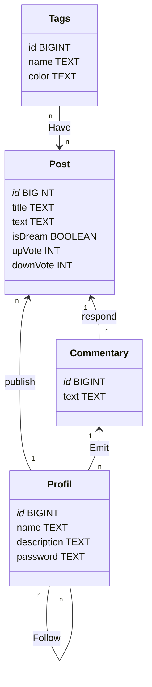
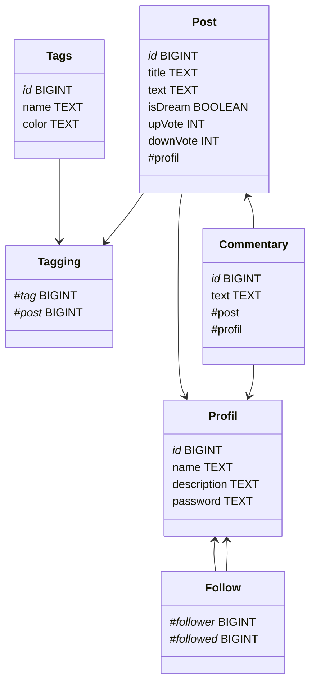

# **Fukashitapi** 
### Vos rêves valent le coup d'être diffusé

# Présentation

Cet API permet le stockage et la récupération des informations stockés pour le bon fonctionnement de votre forum préféré :
**Fukafukashita**

# Base De données 

## MCD : 

## MLD : 

# Développeurs 🧑‍💻

- Corentin RICHARD : corentin.richard@etu.uca.fr
- Rémi ARNAL : remi.arnal@etu.uca.fr
- Aurian JAULT : aurian.jault@etu.uca.fr
- Dorian HODIN : dorian.hodin@etu.uca.fr

